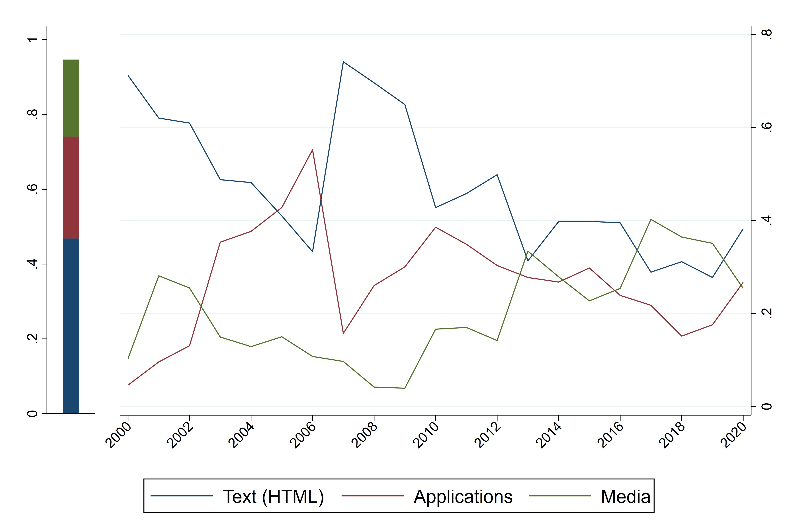
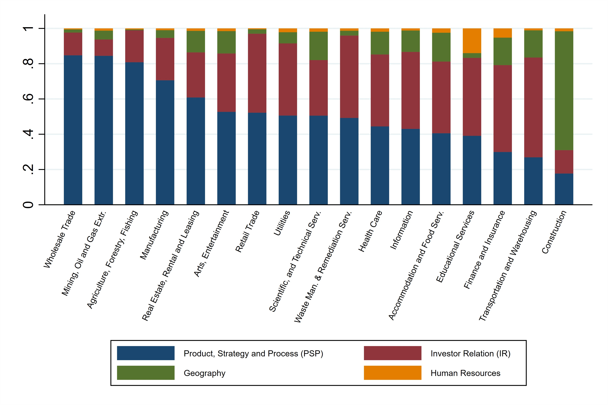
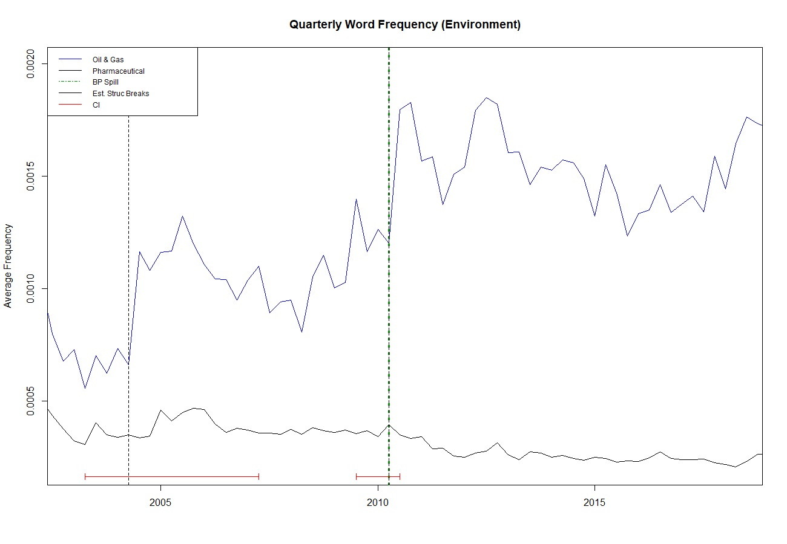

  

# Company Websites: A New Measure of Disclosure
*Romain Boulland, Thomas Bourveau, Matthias Breuer*

This repository contains the data and code to extend the findings of Boulland, Bourveau, and Breuer (2025): "*Company Websites: A New Measure of Disclosure*" (<a href="https://onlinelibrary.wiley.com/doi/10.1111/1475-679X.70007?af=R">Journal of Accounting Research</a>), based on historical website data provided by the <a href="https://web.archive.org/">Wayback Machine</a>.

Data available includes, for the universe of U.S. public firms: i) the main voluntary disclosure measure (*Website Size*); and ii) a content measure, i.e., the fraction of each website that can be attributed to broad topics (*Investor Relations, Product Strategy and Processes, Human Resources, Geography*).

The code section details how to construct the measure for firms outside the U.S. public firm sample, including large samples of firms (e.g., private firms and international firms), or to extract other topics of interest (e.g., those related to CSR disclosures).

Finally, in the last section, we detail how to download and parse the full content of company websites using a bag-of-words representation. Due to the time-intensive nature of this task, it should be restricted to smaller sets of firms (e.g., environmental disclosure of Oil & Gas companies, as in Boulland, Bourveau, and Breuer 2025).

We hope these resources will be useful to all researchers interested in exploiting historical archives of company websites.

_Note: Researchers interested in replicating the results of our paper—particularly the relationship between our voluntary disclosure measures and liquidity measures for a sample of public and private U.S. firms—should refer to the <a href="https://www.chicagobooth.edu/research/chookaszian/journal-of-accounting-research/online-supplements-and-datasheets">replication package</a>._

## Data for the universe of U.S. public firms
_Data in this section cover the period 2000–2020 for U.S. public firms. They can be easily matched with Compustat using the gvkey identifier. Researchers interested in other topics developed on websites should refer to the code section._
- **[public_firm_size.dta](Docs/measures/public_firm_size.dta)**: A Stata dataset containing our website-based measure of disclosure at the quarterly level. The dataset contains the following variables:
  - `gvkey`: the gvkey identifier of the firm;
  - `q`: the quarter during which the size of the corporate website was measured;
  - `size_website_q`: the size of the website (in bytes) that quarter;
  - `size_mim_*`: the sum of the sizes of the elements belonging to mimetype '*' (i.e., plain text, images, videos, or applications).

  

- **[public_firm_topics.dta](Docs/measures/public_firm_topics.dta)**: A Stata dataset containing the share of website content by topic at the yearly level. The dataset contains the following variables:
  - `gvkey`: the gvkey identifier of the firm;
  - `y`: the year during which the topics are measured;
  - `ir`: the size of the website dedicated to Investor Relations;
  - `pm`: the size of the website dedicated to Product, Strategy, and Processes;
  - `geo`: the size of the website dedicated to Geography;
  - `hr`: the size of the website dedicated to Human Resources;
  - `total`: the size of the website (in bytes) that can be classified that year.

  

## Code to construct the website-based measures of disclosure
_Code in this section can easily be tailored to construct the measures for firms outside the U.S. public firm sample (e.g., private firms and international firms), or to extract other topics of interest (e.g., those related to CSR disclosures). There are two steps to follow: i) download website indexes from the Wayback Machine API; ii) compute the disclosure measures from the raw indexes using either the Stata code or the Python code provided._

### Downloading index data from the Wayback Machine API (link)
Wayback Machine data are extracted by querying the [Wayback Machine API](https://archive.org/developers/wayback-cdx-server.html) using the following **api_call**.

**http://web.archive.org/cdx/search/cdx?url=www.cecoenviro.com&matchtype=domain&collapse=timestamp:10&matchType=prefix&output=json**

In this command, the field **url** should point to the company website. To collect the data on a large sample of firms, there are several possibilities, among which:
- the **wget** command, available as a command line in Microsoft Windows (using, e.g., WSL), macOS, or Linux. The general syntax is **wget api_call**. The command also accepts a list of files as an argument, which allows for batch downloading. See the wget documentation for more details; 
- the **copy** command in Stata, which allows copying a URL to a file. The syntax is **copy api_call *outputfile***.

The resulting file is a JSON file, one for each company (**[Example](Docs/construct_measure/example_wayback.json)**).

_For large samples, researchers may find it useful to use cloud services (e.g., AWS) to run these tasks in parallel. See, for instance, [this script](Docs/construct_measure/download_wayback.sh) for AWS._

### Compute the main disclosure variable (_Website Size_)
The following code computes the quarterly website-based measure of disclosure.
- **[A Stata version](Docs/construct_measure/compute_website_size_format.do)**. Because Stata does not natively read JSON files, it is necessary to first translate them into CSV files using the [CSV converter](Docs/construct_measure/json_to_csv.py);
- **[A Python version](Docs/construct_measure/construct_measure.py)**, which can be executed directly on JSON files.

### Compute website content measures
By parsing each URL, it is possible to associate broad topics with company websites.
- **[The Stata version](Docs/construct_measure/compute_website_content.do)** applies to CSV files. The dictionary used is available in [Excel format](Docs/data/keywords_classification.xlsx).
- **[The Python version](Docs/construct_measure/urlparse_content.py)** applies directly to JSON files. The dictionary used is available as a set of [text files](Docs/data/dic_topics). The resulting JSON files can be converted into a single CSV file using [this code](Docs/construct_measure/dic_to_stata.py).

## Parsing corporate websites

_This section details how to download and parse the full content of company websites, not just the website indexes. Due to the time-intensive nature of this task, it is best to focus on a small set of firms (e.g., environmental disclosure of Oil & Gas companies, as depicted in the graph below)._

The program **[WaybackScraper.py](website_scraping/WaybackScraper.py)** scrapes archived company webpages stored on the Wayback Machine and provides a representation of their textual content using a bag-of-words representation. Please customize the **[config.py](website_scraping/config.py)** file before launching the program.

**Main Parameters** (**[WaybackScraper.py](website_scraping/WaybackScraper.py)**)
- ***host***:*str* Host URL for a given company;
- ***freq***: *DateOffset, Timedelta, or str* Frequency at which the sent URL is scraped. For more information on offset aliases, see [here](https://pandas.pydata.org/pandas-docs/stable/user_guide/timeseries.html#offset-aliases);
- ***date_range***: *(str,str),default None* Date (yyyy/mm/dd) range of URL search.

**Program configuration** (**[config.py](website_scraping/config.py)**)
- ***path***: *str, default ‘./’* Path to store all outputs;
- ***max_url***: *int, default 10* The maximum number of URLs to scrape within the tree of a given root URL;
- ***max_sub***: *int default 1* The maximum level of sub-URLs to scrape within the tree of a given root URL;
- ***alpha_token***: *bool, default True* Boolean variable indicating whether consider alphabetic tokens exclusively or not;
- ***word_len***: *(int, int), default (1, 20)* Length range of accepted tokens;
- ***stop_words***: *list, default nltk.corpus.stopwords.words(‘english’)* A list of stopwords escaped during tokenization;
- ***stemmer***: *nltk.stem.api.StemmerI, default nltk.stem.porter.PorterStemmer()* A stemmer object to stem tokenized words. 
- ***status_code***: *[str, …], default [‘200’]* A list of HTTP status code allowed. For more information on HTTP status code, check [here](https://en.wikipedia.org/wiki/List_of_HTTP_status_codes);
- ***mime_type***: *[str, …], default [‘text/html’]* A list of MIME types allowed. For more information on MIME types, check [here](https://developer.mozilla.org/en-US/docs/Web/HTTP/Basics_of_HTTP/MIME_types/Common_types);
- ***header***: *dict, default {}* Headers when requesting a URL when request();
- ***parser***: *str, default ‘lxml’* The parser used to parse scraped HTMLs;
- ***raw***: *bool, default False* Boolean variable indicating whether store the raw HTML text or not.

  

